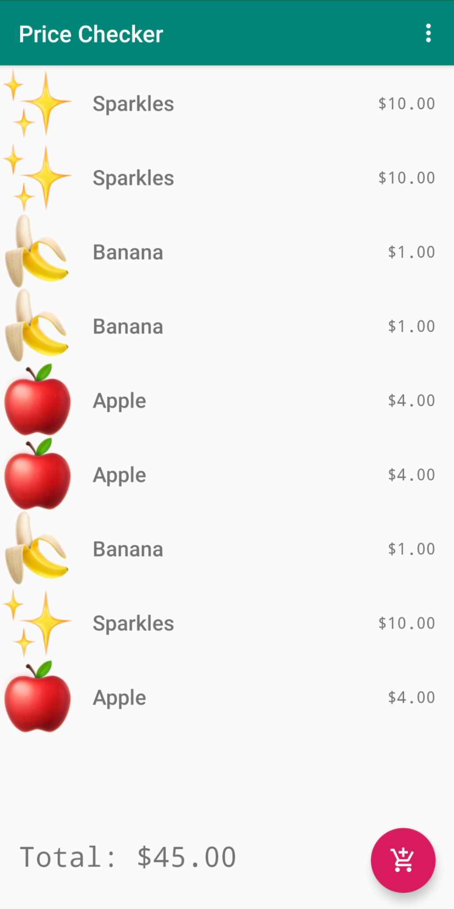

# Jungsoo's Market Price Checker App

## Summary and Scope

Use the Price Checker app to add items to your shopping cart list by using your phone's camera to scan QR codes.

## Features

* QR Code scanning to add items.
* Remove items.
* Shopping cart list is persisted locally.

## Developer decisions

* Followed recommended architectural decisions by Google. Seperation of concerns, view models, and repositories.
* Saving Jungsoo’s Market database and the user's shopping list to local database using Room.
* Using Picasso library to fetch and load product images.
* Used CameraX and Google's Machine Learning for scanning QR codes which makes it super fast and instant.
* Followed Google's Material Design best practices.

## Future Improvements

* Add Unit Testing.
* Test app on multiple devices.
* Improve code comments and documentation.
* Code Refactoring.
* Add Webservice to fetch Jungsoo's Market database from a server.
* Allow user to search for products by name or code.
* Add App Icon

## Using the App

1) Download and install the latest .apk file from GitHub releases, or build the project using Android Studio.
2) Open the app and press the shopping cart button to scan QR codes.
3) Use https://www.qr-code-generator.com/ to generate QR codes.

0001 = Banana

0002 = Apple

0003 = Sparkles

4) Long press on an item to remove it from shopping cart.

## Demo Pictures

